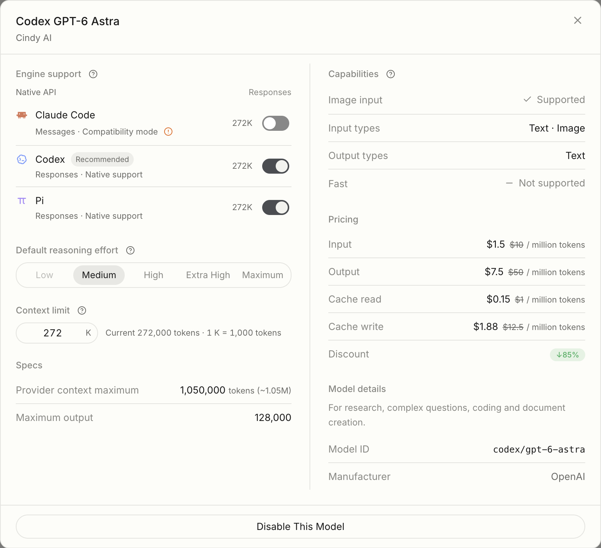

# 模型配置完整性核对（2026-09-07）

本轮覆盖本地 Registry 的 88 个条目、Pi 的 100 个原生条目、Cindy 自管 Codex 原生模型缓存，以及两区域公开 Model Access 清单。
只读取模型元数据，没有复制凭证或发起推理请求；公开清单不代表特定账号的付费权益。

## 已确认并修复的客户端缺口

| 数据面 | 问题 | 修正 |
| --- | --- | --- |
| 默认 / 最大窗口 | Astra、Sol、Terra、Luna 原生缓存为 272000 / 872000，最大值在导入时丢失 | 导入最大值，经过 Registry 更新和 Claude 订阅桥保留；不混入 Pi / Gateway |
| 图片输入 | `input_modalities` 未导入，只能依赖型号猜测 | 图片 / 纯文本的显式声明均导入，缺失仍未知 |
| Fast | 原生空速度列表变成未知，Registry 可重新宣称支持；5.4 Mini 存在该冲突 | 区分 false 与缺失，禁止旧 Registry 开启账号明确不支持的速度档 |
| 简略刷新 | `model/list` 不含完整窗口 / 图片能力，却覆盖先前 cache 元数据 | 对存续型号保留这两类字段，成员 / 排序 / 档位随新列表；cache 与账号清空仍完整替换 |
| 默认档位 | cache 默认只检查枚举，可能不在模型支持列表中 | 校验从属关系，失配时使用共享默认策略 |

## 官方复核与本地整理

本轮未跨仓修改 Server，也未改正式版安装包或用户偏好。

1. 官方 Astra / Sol / Terra / Luna 规格均为 1,050,000 容量、128,000 最大输出。
   本地 Registry 已分开声明容量与 Codex / Claude 272,000 工作默认；原生账号最大值优先。
2. GPT-5.4 Mini 的 Registry Fast 与当前账号原生空速度列表冲突，以账号明确不支持为准；不替所有账号改公共能力。
3. Astra 官方有 low，Sol / Terra / Luna 官方有 low / max；Gateway 未开放的档位显示但禁用。
   每引擎 `efforts` 和空数组继续控制实际可选范围，不用标准补出可发送参数。
4. 独立 GPT `[1m]` 从新选择和管理入口退出；完整目录、历史价与存量模型 ID 保留兼容。
5. DeepSeek V4 Pro 已按官方 GA 公告补回 low（见下方来源），保留默认 high；Gateway 未开放 low 时置灰。以下为核对开始时两区域均存在的差异。通用 Registry 还服务公共直连，不能一律按 Gateway 重写全模型能力。

| 模型 | Registry 基础档位 | Gateway 基础档位 |
| --- | --- | --- |
| DeepSeek V4 Flash | low / high / max | medium / high / max |
| DeepSeek V4 Pro | high / max | medium / high / max |
| GLM 5.2 | minimal / high / max | minimal / medium / high / max |
| GLM 5.3 | low / high / max | low / medium / high / max |

来源：[Global 模型清单](https://model-access.cindy.app/api/model-access/models?schemaVersion=5)、
[中国大陆版模型清单](https://model-access.cindy.com.cn/api/model-access/models?schemaVersion=5)、
[Global Registry](https://model-access.cindy.app/api/model-catalog/catalog)。
核对时公开模型分别为 29 条（27 chat / 2 image）、19 条（13 chat / 4 image / 2 video）；
两区域公共 Registry revision 均为 `2026-09-05T05:54:12.833Z`。

## 全目录检查的边界

- Registry 的 88 个条目均有原生协议字段。部分条目只承担参考价、生命周期或默认意图，缺少运行字段不等于配置丢失。
- Pi 的 100 个条目均有 id/name/api/contextWindow/maxTokens/input/reasoning/cost；保留独立 API / 订阅协议和窗口。
- 保留既有标准/Fast/缓存/长输入价格及币种。Astra 自 2026-09-07 起补齐 >272K 的标准 / Fast 参考价：输入及缓存 2 倍、输出 1.5 倍；保留此前未知长输入历史，不回填猜测。
- 新增实际装配目录遍历回归：重复 ID、正整数窗口 / 输出、默认档位从属、最大容量不小于工作默认；
  同时覆盖 Registry 更新、简略刷新、账号清空和 Gateway 272K / 1050K 分离。
- 既有 `modelRegistryConsistency.test.ts` 继续校验价格区间与窗口 / 输出自洽，
  `piCatalogCorrections.test.ts` 继续覆盖 Pi 上游优先及公共 API / 订阅分离。
- 未对每个模型进行真实推理、收费、长窗口请求验收。结构性检查通过不等于所有供应商事实均已核实。

官方复核：[Astra](https://developers.openai.com/api/docs/models/gpt-6-astra)、
[Sol](https://developers.openai.com/api/docs/models/gpt-5.6-sol)、
[Terra](https://developers.openai.com/api/docs/models/gpt-5.6-terra)、
[Luna](https://developers.openai.com/api/docs/models/gpt-5.6-luna)。
[DeepSeek V4 GA 公告](https://api-docs.deepseek.com/news/news260813/)确认 Pro / Flash 均有 low / high / max。
公共 API 不声明 ultra；账号 Codex 自己提供的 ultra 不推给其它通道。
Gateway 价格 / 折扣保持原值，新增回归校验折扣同时作用于输入、输出与缓存。
静态表以下保留核对开始时的快照，用于追踪差异；当前值以生产 JSON 为准。

## 静态字段清单

“—”表示该层未声明，须由实际来源补充或保留未知，不等于不支持；不得为填满字段写成 0 / false / 空数组。
基础字段与 perAgent 分列。此表为审阅清单，不是第二份生产目录。

核对时间：2026-09-07T08:18:42.830419+00:00；本地 revision：`2026-09-05T13:36:11.674Z`。

| 条目 | 状态 | 静态窗口 | 最大输出 | 基础档位 | 默认 | Fast | 逐引擎差异 |
| --- | --- | ---: | ---: | --- | --- | --- | --- |
| openai/gpt-5.6-sol | active | 272000 | 128000 | low / medium / high / xhigh / max | medium | True | codex: efforts=['low', 'medium', 'high', 'xhigh', 'max', 'ultra'] |
| openai/gpt-5.6-sol[1m] | active | 1000000 | 128000 | low / medium / high / xhigh | medium | True | — |
| xd/gpt-5.6-sol | active | 1050000 | 128000 | low / medium / high / xhigh / max | medium | True | claude-code: supportsFastMode=False; codex: contextWindow=272000, efforts=['low', 'medium', 'high', 'xhigh', 'max', 'ultra'] |
| openai/gpt-5.6-terra | active | 272000 | 128000 | low / medium / high / xhigh / max | medium | True | codex: efforts=['low', 'medium', 'high', 'xhigh', 'max', 'ultra'] |
| xd/gpt-5.6-terra | active | 1050000 | 128000 | low / medium / high / xhigh / max | medium | True | claude-code: supportsFastMode=False; codex: contextWindow=272000, efforts=['low', 'medium', 'high', 'xhigh', 'max', 'ultra'] |
| openai/gpt-5.6-luna | active | 272000 | 128000 | low / medium / high / xhigh / max | medium | — | — |
| xd/gpt-5.6-luna | active | 1050000 | 128000 | low / medium / high / xhigh / max | medium | — | codex: contextWindow=272000 |
| openai/gpt-5.5 | active | 272000 | 128000 | low / medium / high / xhigh | medium | True | codex: contextWindow=272000 |
| xd/gpt-5.5 | active | 1050000 | 128000 | low / medium / high / xhigh | medium | True | claude-code: supportsFastMode=False; codex: contextWindow=272000 |
| openai/gpt-5.4 | active | 272000 | 128000 | low / medium / high / xhigh | medium | True | codex: contextWindow=272000 |
| xd/gpt-5.4 | active | 1050000 | 128000 | low / medium / high / xhigh | medium | True | claude-code: supportsFastMode=False; codex: contextWindow=272000 |
| openai/gpt-5.4-mini | active | 272000 | 128000 | low / medium / high / xhigh | medium | True | claude-code: supportsFastMode=False; codex: contextWindow=272000 |
| xd/gpt-5.4-mini | active | 400000 | 128000 | low / medium / high / xhigh | medium | True | claude-code: supportsFastMode=False; codex: contextWindow=272000 |
| openai/gpt-5.4-pro | active | 1050000 | 128000 | — | — | — | — |
| openai/gpt-5.5-pro | active | 1050000 | 128000 | — | — | — | — |
| openai/gpt-5.6-cyber | active | 400000 | 128000 | — | — | — | — |
| openai/gpt-6-astra | active | 272000 | 128000 | low / medium / high / xhigh / max | medium | True | codex: efforts=['low', 'medium', 'high', 'xhigh', 'max', 'ultra'] |
| anthropic/claude-fable-5-1 | active | 1000000 | 128000 | low / medium / high / xhigh / max | medium | — | — |
| anthropic/claude-fable-5 | active | 1000000 | 128000 | low / medium / high / xhigh / max | medium | False | — |
| anthropic/claude-mythos-5 | active | 1000000 | 128000 | low / medium / high / xhigh / max | medium | — | — |
| anthropic/claude-opus-5 | active | 1000000 | 128000 | low / medium / high / xhigh / max | medium | False | — |
| anthropic/claude-opus-4-8 | active | 1000000 | 128000 | low / medium / high / xhigh / max | medium | False | — |
| anthropic/claude-opus-4-7 | active | 1000000 | 128000 | low / medium / high / xhigh / max | medium | False | — |
| anthropic/claude-opus-4-6 | active | 1000000 | 128000 | low / medium / high / max | medium | False | — |
| anthropic/claude-opus-4-5 | active | 200000 | 64000 | low / medium / high | medium | False | — |
| anthropic/claude-sonnet-5 | active | 1000000 | 128000 | low / medium / high / xhigh / max | medium | False | — |
| anthropic/claude-sonnet-4-6 | active | 1000000 | 128000 | low / medium / high / max | medium | False | — |
| anthropic/claude-sonnet-4-5 | active | 200000 | 64000 |  | — | False | — |
| anthropic/claude-haiku-4-5 | active | 200000 | 64000 |  | — | False | — |
| xai/grok-4.6 | active | 500000 | — | low / medium / high / xhigh | medium | — | — |
| xai/grok-4.5 | active | 500000 | — | low / medium / high | medium | — | — |
| xai/grok-4.3 | active | 1000000 | — | low / medium / high | medium | — | codex: efforts=['low', 'medium', 'high'] |
| xai/grok-build-0.1 | active | 256000 | — |  | — | — | — |
| xai/grok-4.20-multi-agent-0309 | active | 1000000 | — | low / medium / high / xhigh | medium | — | — |
| xai/grok-4.20-0309-reasoning | active | 1000000 | — |  | — | — | — |
| xai/grok-4.20-0309-non-reasoning | active | 1000000 | — |  | — | — | — |
| xai/grok-4.20 | deprecated | 1000000 | — | low / medium / high / xhigh | medium | — | — |
| xai/grok-code-fast | deprecated | 256000 | — |  | — | — | — |
| xd/codex-gpt-5.6-luna | — | — | — | — | — | — | — |
| xd/codex-gpt-5.6-sol | — | 372000 | 128000 | low / medium / high / xhigh / max | medium | True | claude-code: supportsFastMode=False; codex: contextWindow=272000, efforts=['low', 'medium', 'high', 'xhigh', 'max', 'ultra'] |
| xd/codex-gpt-5.6-terra | — | 372000 | 128000 | low / medium / high / xhigh / max | medium | True | claude-code: supportsFastMode=False; codex: contextWindow=272000, efforts=['low', 'medium', 'high', 'xhigh', 'max', 'ultra'] |
| xd/codex-gpt-5.5 | — | 272000 | 128000 | low / medium / high / xhigh | medium | True | claude-code: supportsFastMode=False |
| xd/codex-gpt-5.4 | — | 272000 | 128000 | low / medium / high / xhigh | medium | True | claude-code: supportsFastMode=False |
| google/gemini-3.7-flash | active | 1000000 | 65536 | low / medium / high | medium | False | — |
| google/gemini-3.6-flash | active | 1000000 | 65536 | minimal / low / medium / high | medium | False | — |
| google/gemini-3.5-flash | — | 1000000 | 65536 | minimal / low / medium / high | medium | False | — |
| google/gemini-3.1-pro-preview | — | 1000000 | 65536 | low / medium / high | medium | False | — |
| google/gemini-3-flash-preview | — | 1000000 | 65536 | minimal / low / medium / high | medium | False | — |
| google/gemini-3.5-flash-lite | active | 1000000 | 65536 | minimal / low / medium / high | medium | False | — |
| google/gemini-3.1-flash-lite | active | 1000000 | 65536 | — | — | False | — |
| bytedance-seed/seed-2.1-pro | — | 256000 | 256000 | minimal / low / medium / high | medium | False | claude-code: efforts=['low', 'medium', 'high'] |
| qwen/qwen3.8-max | — | 983616 | 131072 | low / medium / high / xhigh | medium | False | — |
| qwen/qwen3.8-max-preview | retired | 983616 | — | low / high / xhigh | high | False | — |
| qwen/qwen3.7-max | — | 992000 | 65536 |  | — | False | — |
| moonshotai/kimi-k2.7-code | active | 262144 | — |  | — | — | — |
| moonshotai/kimi-k2.7-code-highspeed | active | 262144 | — |  | — | — | — |
| moonshotai/kimi-k2.6 | — | 262144 | — |  | — | False | — |
| z-ai/glm-5.1 | — | 200000 | 131072 |  | — | False | — |
| z-ai/glm-5.2 | — | 1000000 | 131072 | minimal / high / max | high | False | claude-code: efforts=['high', 'max'] |
| z-ai/glm-5.3 | active | 1000000 | 131072 | low / high / max | high | False | — |
| z-ai/glm-5.3-flash | active | 1000000 | 131072 | — | — | — | — |
| xd/z-ai-glm-5.3-flash | active | 1000000 | 131072 | — | medium | — | — |
| deepseek/deepseek-v4-pro | — | 1048576 | 384000 | high / max | high | False | — |
| deepseek/deepseek-v4-flash | — | 1048576 | 384000 | low / high / max | high | False | — |
| openai/gpt-5.4-nano | active | 400000 | 128000 | low / medium / high / xhigh | medium | — | — |
| xd/codex-gpt-5.4-mini | — | 272000 | 128000 | low / medium / high / xhigh | medium | — | — |
| minimax/minimax-m3 | active | 1000000 | — | — | — | — | — |
| minimax/minimax-m2.7 | active | 204800 | — | — | — | — | — |
| minimax/minimax-m2.7-highspeed | active | 204800 | — | — | — | — | — |
| minimax/minimax-m2.5 | active | 204800 | — | — | — | — | — |
| minimax/minimax-m2.5-highspeed | active | 204800 | — | — | — | — | — |
| minimax/minimax-m2.1 | active | 204800 | — | — | — | — | — |
| minimax/minimax-m2.1-highspeed | active | 204800 | — | — | — | — | — |
| minimax/minimax-m2 | active | 204800 | — | — | — | — | — |
| moonshotai/kimi-k3 | — | 1048576 | 1048576 | low / high / max | high | False | — |
| qwen/qwen3.6-plus | — | 1048576 | 65536 |  | — | — | — |
| qwen/qwen3.6-plus-api | active | 991808 | 65536 | — | — | — | — |
| qwen/qwen3.7-flash | active | 991808 | 65536 |  | — | — | — |
| qwen/qwen3.8-flash | active | 991808 | 131072 |  | — | — | — |
| qwen/qwen3.7-plus | active | 991808 | 65536 |  | — | — | — |
| qwen/qwen3.6-flash | active | 991808 | 65536 |  | — | — | — |
| xd/codex-gpt-5.5-auto | — | — | 128000 | — | — | — | — |
| qwen/qwen3.8-27b | — | 991808 | 131072 | low / medium / high / xhigh | medium | — | — |
| tencent/hy3 | — | 262144 | 128000 | low / medium / high | medium | — | — |
| meta/muse-spark-1.2 | — | — | — | — | — | — | — |
| xd/moonshotai-kimi-k3 | — | 1048576 | 1048576 | low / medium / high / max | medium | False | — |
| xd/deepseek-deepseek-v4-flash-vision-exp | — | — | — | — | medium | — | — |
| xd/tencent-hy4-preview | — | — | — | — | medium | — | — |

## 验证结果

- 提交前根 `pnpm test:unit:related -- --workspace-concurrency=1` 完整通过：Desktop、Mobile、lizi-mcps、maker-core、model-providers、orca-workflow。
  DeepSeek Pro 的 low 预期已按官方 GA 标准更新；此前定向集合 13 文件 / 391 用例也全部通过。
- Desktop 类型检查通过；新增目录 / 缓存回归 63 用例、模型详情交互 22 用例通过。
- 额外运行 model-providers 的 `build` 类型检查发现原有 `src/__tests__/user-provider.test.ts:1236`
  将 null 赋给不接受 null 的 Registry 默认字段；该文件与 HEAD 一致，本轮未修改。
- `git diff --check` 通过。未修改正式版用户数据；macOS Global 隔离 dev 已核对 Low 按钮可见且 disabled，Light 截图见下方。Dark 实机与收费请求未验收。

## Dev 实际入口

`codex/gpt-6-astra`、`openai/gpt-6-astra` 和裸 GPT ID 共同匹配官方标准档位。当前 dev 的三个引擎可选值均为 medium/high/xhigh/max；Low 仅进入展示列表并置灰。未实测发送 Low，不能据此断言 Gateway 后端不支持。

